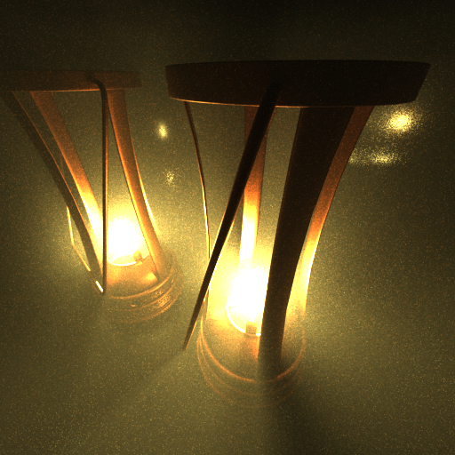

## Google Summer of Code 2017 - final report
## Volume Rendering for appleseed

As a participant of Google Summer of Code I was working on volume rendering for [appleseed]('http://appleseedhq.net).
You can find the proposal of my project at the following link: [original proposal](https://github.com/Biart95/appleseed-volumetric-rendering-proposal/blob/master/proposal.md).
During the summer I successfully reached most of the proposed goals, allowing the appleseed to create its first volume renders.
Below you can find the detailed results of my work.

### Community bonding period

In the beginning of my GSoC I was discussing the future project with my mentors. We defined the scope of our project that
appeared to be pretty big and decided that we should concentrate on rendering part and leave OSL volume shaders for the
after-GSoC work. On the other hand, we found a couple of publications that can significantly improve the quality of volume 
rendering ([1], [2]) and decided to include them in the summer schedule.

Most importantly, during the spring I examined almost the whole rendering core of appleseed and got familiar with 
friendly and helping appleseed community. I also fixed a few minor bugs ([#1351](https://github.com/appleseedhq/appleseed/pull/1351),
[#1352](https://github.com/appleseedhq/appleseed/pull/1352)), implemented IES parser
([#1414](https://github.com/appleseedhq/appleseed/pull/1414)) and made first steps in developing IES lights project
(more details [here](https://github.com/appleseedhq/appleseed/wiki/List-of-Project-Ideas-for-GSoC-2017#project-2-ies-light-profiles)).

### Coding period and results

Here is the list of deliverables that were successfully achieved:

- Raymarching engine that extends appleseed path tracer and is capable of rendering homogeneous participating media inside
closed surfaces
- Support for both single and multiple scattering
- Support for advanced distance sampling for volume rendering based on the [1]
- Complex multiple importance sampling for distance sampling and light sampling based on the [1] and [2]
- Database consisting of reference images that are used to compare and test rendering results
- New _Volume_ entity exposed to the UI of appleseed.studio

There is also a [Volume Rendering project page](https://github.com/appleseedhq/appleseed/projects/1) where we keep track on tasks related to volume rendering and this GSoC project in particular.

### Source code

Source code consists of a few pull requests, most of which were merged and became a part of appleseed software.

List of merged pull requests:

- [Volume Rendering - Entities](https://github.com/appleseedhq/appleseed/pull/1434)
- [Raymarcher that can compute absorption](https://github.com/appleseedhq/appleseed/pull/1446)
- [Volume Rendering - Simple Scattering](https://github.com/appleseedhq/appleseed/pull/1465)
- [Fixes of path tracer and lighting engines](https://github.com/appleseedhq/appleseed/pull/1492)
- [Small tweaks](https://github.com/appleseedhq/appleseed/pull/1503)
- [Implement clever per-channel distance sampling for participating media](https://github.com/appleseedhq/appleseed/pull/1518)
- [Get rid of templates in Tracer and fix bug in distance sampling](https://github.com/appleseedhq/appleseed/pull/1531)
- [Fix critical bug in volume distance sampling](https://github.com/appleseedhq/appleseed/pull/1538)
- [Volumetric entities redesign](https://github.com/appleseedhq/appleseed/pull/1545)
- [Basic multiple scattering](https://github.com/appleseedhq/appleseed/pull/1556)
- [Fix most of the warnings in appleseed GCC 7 build](https://github.com/appleseedhq/appleseed/pull/1577)

Pull requests waiting for approval:

- [Better importance sampling for volumes](https://github.com/appleseedhq/appleseed/pull/1591)

### Example renders

#### Lanterns demonstrating advanced importance sampling with single scattering, rendered at 64 sample/pixel:

#### Cloud shaped as stanford bunny, multiple scattering, 128 sample/pixel (right - lighted with with cone EDF):
 

#### Double scattering and different phase functions. (left: Henyey-Greenstein phase function with g = 0.8, right: isotropic phase function)
 

### Future work

The work on volume renderer have only begun with my GSoC project, and there are still a plenty of opportunities for making volume rendering faster, more beautiful and more convenient. Here I would like to outline the possible future of the project as it goes beyond the scope of GSoC'17.

#### 1. OSL volume shaders

Firstly I included it in my schedule, but during preliminary discussions we decided to leave it for the future. Nevertheless, it is one of the things that we are going to implement soon, since Open Shading Language brings an outstanding level of flexibility in defining and evaluating properties of various materials. It is also neccessary for integration with modern 3D software such as Autodesk Maya, Gaffer, e.t.c. More for OSL you can read [here](http://opensource.imageworks.com/?p=osl).

#### 2. Efficient photon mapping

Appleseed does not support only pure path tracing, but also can build [photon maps](https://en.wikipedia.org/wiki/Photon_mapping) that help to connect rays from camera and rays from lights. Our goal in the following year - implement the bleeding edge techniques of doing photon mapping for participating media. Some of these techniques operate with photon beams, planes and volumes instead of photons themselves. More information can be found, for example, [here](https://benedikt-bitterli.me/photon-planes/).

#### 3. Faster analogues of path-traced multiple scattering

Straightforward multiple scattering via path tracing is a very nice teqhnique, but it usually takes too much time to converge. There are techniques known that can approximate multiple scattering, for instance, by changing media properties inside the volume. This methods will significantly increase the performance of our volume renderer and might provide a bridge between subsurface scattering techniques and path-traced volume rendering (allowing us to directly integrate light for participating media with distinct refraction coefficient, such as milk).

#### 4. Heterogeneous volumes

All goals mentioned above can increase the quality of rendering for homogeneous volumes. But if we want to render realistic smoke or clouds, we must support the ray marching through heterogeneneous volumes, i.e. volumes with varying density. Efficient methods require some effort to get implemented. They described, for instance, [here](http://www.yiningkarlli.com/projects/specdecomptracking.html).

#### 5. Expose volume rendering to appleseed plugins for Maya, 3ds Max, Gaffer and other 3D software

Appleseed becomes really useful only when it is coupled with some 3D modeling and designing software, so we need to start introducing volumes for these plugins as soon as possible. 

#### 6. Emission for participating media

Participating media sometimes not only absorbs or scatters the light, but also emits it (for example, fire). It would be great to provide support for emissive media, though this goal is less important.

#### 7. More, more and more

There are always new things to do and new goals to achieve. New publications, new improvements, GPU implementation, procedural volumes... And tons of optimizations and refactorings.

### References

1. https://www.solidangle.com/research/egsr2012_volume.pdf
2. https://disney-animation.s3.amazonaws.com/uploads/production/publication_asset/153/asset/siggraph2016SSS.pdf

===

I am happy and thankful to Google and appleseed that they made my summer meaningful! I never thought that I would find so wonderful opportunity to dive into the rendering core of a real engine, but most importantly - I am glad to become a part of the amazing community of appleseed. I am grateful to François Beaune and Esteban Tovagliari - the most responsible mentors and the coolest programmers I've met so far, and I also want to thank Petra Gospodnetic and Gleb Mischenko - my colleagues, young GSoC'ers who code cool stuff and share the motivating atmosphere of appleseed. And of course, thanks to all other contributors who are creating appleseed and making it the greatest renderer of all times!

And yes, it seems my mentors answer not later than next 15 minutes after I write a message to Slack. Always. =)

P.S. Note that newline at the end of this report was not forgotten.
